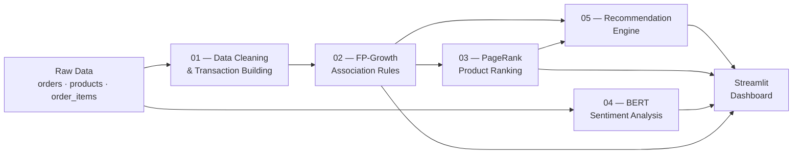

<p align="center">
  
  
  
  
</p>

# 📊 Data Mining Project — E-Commerce Product Recommendation System

A comprehensive **Data Mining** pipeline that combines **Association Rule Mining (FP-Growth)**, **PageRank Analysis**, and **BERT-based Sentiment Analysis** to build an intelligent product recommendation engine for e-commerce order data.

---

## 📌 Table of Contents

- [Overview](#overview)
- [Key Features](#key-features)
- [Project Architecture](#project-architecture)
- [Repository Structure](#repository-structure)
- [Datasets](#datasets)
- [Pipeline Stages](#pipeline-stages)
  - [1. Data Loading & Cleaning](#1-data-loading--cleaning)
  - [2. Association Rule Mining (FP-Growth)](#2-association-rule-mining-fp-growth)
  - [3. PageRank Analysis](#3-pagerank-analysis)
  - [4. BERT Sentiment Analysis](#4-bert-sentiment-analysis)
  - [5. Final Recommendation Engine](#5-final-recommendation-engine)
- [Interactive Dashboard](#interactive-dashboard)
- [Installation & Setup](#installation--setup)
- [Usage](#usage)
- [Technologies Used](#technologies-used)
- [Results & Outputs](#results--outputs)
- [Contributing](#contributing)
- [License](#license)

---

## Overview

This project applies multiple **data mining techniques** to an e-commerce dataset of **33,580 orders** containing **1,197 products** across **59,163 order line items** to discover hidden purchasing patterns and generate smart product recommendations.

The pipeline works in four stages:

1. **Data Cleaning** — Load, merge, and preprocess raw order/product data into market basket transactions.
2. **FP-Growth Association Mining** — Discover frequent itemsets and generate association rules (support, confidence, lift).
3. **PageRank on Product Graph** — Build a directed graph from strong association rules and rank products by importance.
4. **BERT Sentiment Analysis** — Fine-tune a DistilBERT model on product reviews to classify sentiment (positive / neutral / negative).
5. **Recommendation Engine** — Combine association rules + PageRank scores to produce ranked product recommendations.

---

## Key Features

- 🔗 **Association Rule Mining** using the FP-Growth algorithm via `mlxtend`
- 🌐 **PageRank Analysis** on a product co-purchase graph using `networkx`
- 🤖 **BERT-based Sentiment Analysis** with HuggingFace `transformers` (DistilBERT)
- ✅ **Hybrid Recommendation Engine** combining association rules with PageRank scores
- 📊 **Interactive Streamlit Dashboard** with Plotly visualizations for exploring all results
- 📈 **Experiment Tracking** with versioned model outputs and automated best-model selection

---

## Project Architecture



---

## Repository Structure

```
DataMiningProject/
│
├── Data/                              # Input datasets
│   ├── orders.csv                     # 33,580 orders (order_id, customer_id, order_time, payment_method, etc.)
│   ├── products.csv                   # 1,197 products (product_id, category, name, price, cost, margin)
│   ├── order_items.csv                # 59,163 line items (order_id, product_id, unit_price, quantity, total)
│   └── Final_rules.csv               # Generated association rules (antecedents, consequents, support, confidence, lift)
│
├── notebooks/                         # Jupyter notebooks — full analysis pipeline
│   ├── 01_load_and_clean_data.ipynb   # Data loading, merging, cleaning, one-hot encoding
│   ├── 02_fp_growth.ipynb             # FP-Growth frequent itemset mining & rule generation
│   ├── 03_pagerank.ipynb              # Graph construction, PageRank computation, visualization
│   ├── 04_bert_sentiment.ipynb        # BERT fine-tuning for sentiment classification
│   └── 05_final_recommendation.ipynb  # Combining rules + PageRank into final recommendations
│
├── results/                           # Output results
│   ├── association_rules.csv          # Filtered association rules
│   ├── pagerank_scores.csv            # Product PageRank importance scores
│   ├── sentiment_results.csv          # Sentiment classification results
│   └── final_recommendations.csv      # Final product recommendations
│
├── report/
│   └── final_report.docx             # Project report document
│
├── app.py                             # Streamlit interactive dashboard
├── requirements.txt                   # Python dependencies
├── .gitignore                         # Git ignore rules
└── README.md                          # This file
```

---

## Datasets

### Input Data

| File | Records | Description |
|------|---------|-------------|
| `orders.csv` | 33,580 | Customer orders with timestamps, payment methods, discounts, totals, country, device, and source |
| `products.csv` | 1,197 | Product catalog with categories, names, prices, costs, and profit margins |
| `order_items.csv` | 59,163 | Individual line items linking orders to products with quantities and prices |

### Key Data Fields

**Orders:** `order_id`, `customer_id`, `order_time`, `payment_method`, `discount_pct`, `subtotal_usd`, `total_usd`, `country`, `device`, `source`

**Products:** `product_id`, `category`, `name`, `price_usd`, `cost_usd`, `margin_usd`

**Order Items:** `order_id`, `product_id`, `unit_price_usd`, `quantity`, `line_total_usd`

---

## Pipeline Stages

### 1. Data Loading & Cleaning

**Notebook:** `01_load_and_clean_data.ipynb`

- Loads three raw CSV datasets (orders, products, order items)
- Merges order items with product names via `product_id`
- Groups items by `order_id` to build **33,580 market basket transactions**
- Cleans transactions (removes duplicates, empty items, whitespace)
- Applies **one-hot encoding** using `TransactionEncoder` from `mlxtend`
- Outputs a binary basket matrix of shape **(33,580 × 1,195)**

### 2. Association Rule Mining (FP-Growth)

**Notebook:** `02_fp_growth.ipynb`

- Applies the **FP-Growth algorithm** to discover frequent itemsets from the basket matrix
- Generates **association rules** with metrics:
  - **Support** — How frequently the itemset appears
  - **Confidence** — Probability of consequent given antecedent
  - **Lift** — Strength of association (lift > 1 indicates positive correlation)
- Exports rules to `Data/Final_rules.csv` for downstream use

### 3. PageRank Analysis

**Notebook:** `03_pagerank.ipynb`

- Filters **strong rules** (confidence ≥ 0.1, lift ≥ 2) → **68 strong rules**
- Builds a **directed graph** with products as nodes and rules as weighted edges (weight = lift)
  - **124 nodes**, **68 edges**
- Computes **PageRank scores** to identify the most influential products in the co-purchase network
- Visualizes top-ranked products and the full network graph
- Exports scores to `results/pagerank_scores.csv`

**Top Products by PageRank:**

| Product | PageRank Score |
|---------|---------------|
| Lamp Chocolate 506 | 0.0154 |
| Jeans LawnGreen 779 | 0.0154 |
| Water Bottle PaleVioletRed 274 | 0.0154 |
| SSD Lime 581 | 0.0126 |
| Puzzle Orange 783 | 0.0106 |

### 4. BERT Sentiment Analysis

**Notebook:** `04_bert_sentiment.ipynb`

- Fine-tunes **DistilBERT** (`distilbert-base-uncased`) for 3-class sentiment classification:
  - `0` — Negative
  - `1` — Neutral
  - `2` — Positive
- Uses a large-scale clothing reviews dataset (~2.5M reviews)
- Implements a robust experiment framework:
  - Fixed validation/test sets for fair comparison
  - Early stopping based on macro F1
  - Automated best-model tracking with versioned outputs
  - Configurable hyperparameters (learning rate, batch size, epochs, max token length)
- Exports predictions to `results/sentiment_results.csv`

### 5. Final Recommendation Engine

**Notebook:** `05_final_recommendation.ipynb`

- Combines **association rules** and **PageRank scores** to generate product recommendations
- For a given input product:
  1. Finds matching association rules (exact or fuzzy match)
  2. Retrieves consequent products from matching rules
  3. Ranks results by PageRank score
- Provides fallback recommendations from top PageRank products when no rules match

---

## Interactive Dashboard

The project includes a **Streamlit-based interactive dashboard** (`app.py`) with six pages:

| Page | Description |
|------|-------------|
| 🏠 **Home** | Project overview with key metrics (total orders, products, order items) |
| 📁 **Data Overview** | Browse raw datasets with statistics and category distributions |
| 🔗 **Association Rules** | Explore rules with support vs. confidence scatter plots and top-lift bar charts |
| 🌐 **PageRank** | View product importance rankings and top PageRank score visualizations |
| 💬 **Sentiment Analysis** | Examine sentiment distribution with interactive pie charts |
| ✅ **Final Recommendations** | Enter a product name and get real-time recommendations based on rules + PageRank |

### Dashboard Features
- Dark-themed UI with custom CSS styling
- Interactive **Plotly** charts
- Real-time product recommendation search
- Responsive sidebar navigation

---

## Installation & Setup

### Prerequisites

- **Python 3.10+** (developed with Python 3.12)
- **pip** package manager
- **GPU (optional)** — Recommended for BERT fine-tuning (notebook 04)

### 1. Clone the Repository

```bash
git clone https://github.com/aliabdou92019/DataMiningProject.git
cd DataMiningProject
```

### 2. Create a Virtual Environment (Recommended)

```bash
python -m venv venv
source venv/bin/activate        # Linux/macOS
venv\Scripts\activate           # Windows
```

### 3. Install Dependencies

```bash
pip install -r requirements.txt
```

### 4. Install Additional Dashboard Dependencies

```bash
pip install streamlit plotly
```

---

## Usage

### Run the Jupyter Notebooks

Execute the notebooks **in order** for the complete pipeline:

```bash
jupyter notebook
```

1. `01_load_and_clean_data.ipynb` — Prepares transaction data
2. `02_fp_growth.ipynb` — Mines association rules
3. `03_pagerank.ipynb` — Computes product rankings
4. `04_bert_sentiment.ipynb` — Fine-tunes BERT (best run on Google Colab with GPU)
5. `05_final_recommendation.ipynb` — Generates recommendations

### Launch the Dashboard

```bash
streamlit run app.py
```

The dashboard will open at `http://localhost:8501` in your browser.

---

## Technologies Used

| Category | Technology |
|----------|-----------|
| **Language** | Python 3.12 |
| **Data Processing** | Pandas, NumPy |
| **Association Mining** | mlxtend (FP-Growth, TransactionEncoder) |
| **Graph Analysis** | NetworkX (PageRank) |
| **NLP / Sentiment** | HuggingFace Transformers (DistilBERT), PyTorch |
| **Machine Learning** | scikit-learn |
| **Visualization** | Matplotlib, Seaborn, Plotly |
| **Dashboard** | Streamlit |
| **Notebooks** | Jupyter |

### Full Dependencies (`requirements.txt`)

```
pandas
numpy
matplotlib
seaborn
networkx
mlxtend
datasets
transformers
torch
scikit-learn
jupyter
```

---

## Results & Outputs

All computed results are saved in the `results/` directory:

| File | Description |
|------|-------------|
| `association_rules.csv` | Filtered association rules from FP-Growth |
| `pagerank_scores.csv` | Product importance scores from PageRank (124 products ranked) |
| `sentiment_results.csv` | Sentiment predictions for product reviews |
| `final_recommendations.csv` | Generated product recommendations |

---

## Contributing

Contributions are welcome! To contribute:

1. **Fork** the repository
2. **Create** a feature branch (`git checkout -b feature/my-feature`)
3. **Commit** your changes (`git commit -m "Add my feature"`)
4. **Push** to the branch (`git push origin feature/my-feature`)
5. **Open** a Pull Request

---

## License

This project is developed for academic/educational purposes as part of a Data Mining course project.

---

<p align="center">
  <b>Built with ❤️ using Python, Streamlit, and HuggingFace Transformers</b>
</p>
