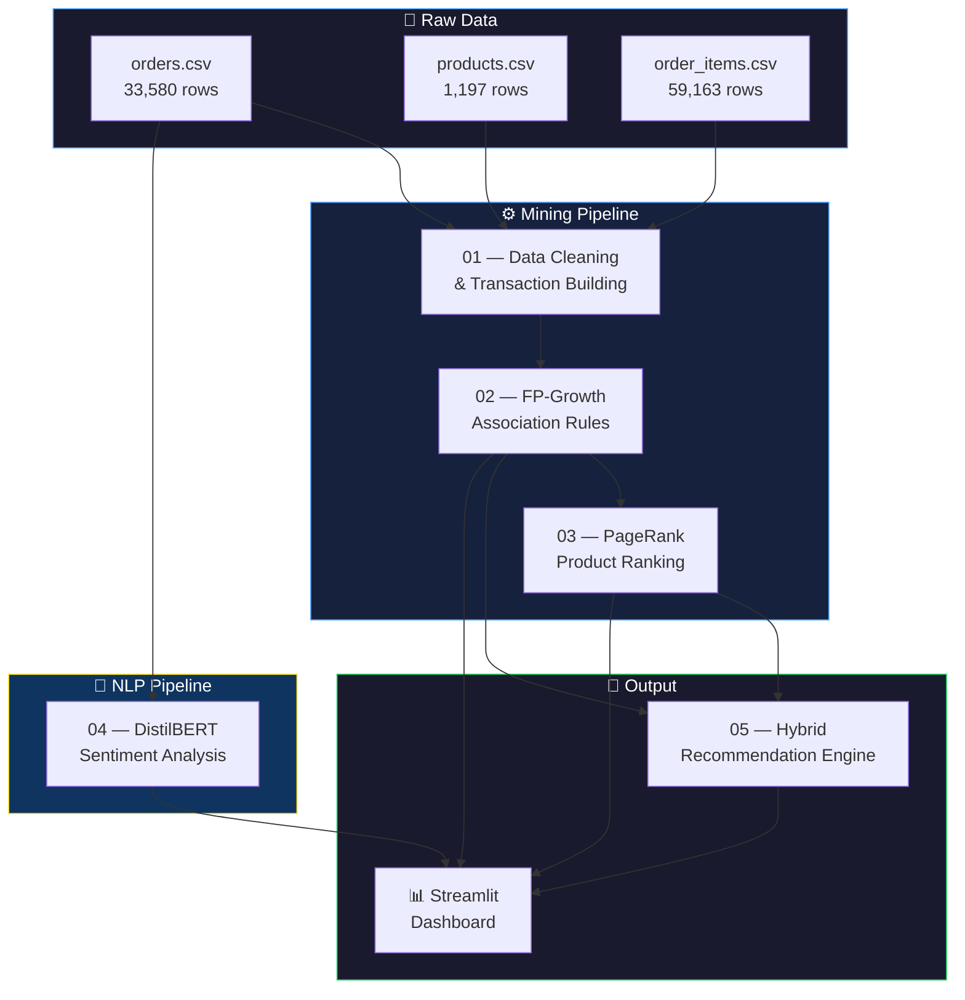

<div align="center">

# 📊 E-Commerce Product Recommendation System

### A Data Mining Pipeline Powered by FP-Growth, PageRank & BERT

<br/>

[](https://www.python.org/)
[](https://streamlit.io/)
[](https://huggingface.co/distilbert-base-uncased)
[](https://networkx.org/)
[](#license)

<br/>


</div>

<br/>

> **TL;DR** — This project mines an e-commerce dataset of 33,580 orders to discover hidden purchasing patterns using **FP-Growth association rules**, ranks products by influence with **PageRank**, classifies review sentiment with **DistilBERT**, and combines everything into a **hybrid recommendation engine** served through an interactive **Streamlit dashboard**.

---

## 📑 Table of Contents

- [Overview](#-overview)
- [Architecture](#-architecture)
- [Repository Structure](#-repository-structure)
- [Datasets](#-datasets)
- [Pipeline Stages](#-pipeline-stages)
  - [Stage 1 — Data Cleaning & Transaction Building](#stage-1--data-cleaning--transaction-building)
  - [Stage 2 — FP-Growth Association Mining](#stage-2--fp-growth-association-mining)
  - [Stage 3 — PageRank Product Ranking](#stage-3--pagerank-product-ranking)
  - [Stage 4 — BERT Sentiment Analysis](#stage-4--bert-sentiment-analysis)
  - [Stage 5 — Hybrid Recommendation Engine](#stage-5--hybrid-recommendation-engine)
- [Interactive Dashboard](#-interactive-dashboard)
- [Getting Started](#-getting-started)
- [Technologies](#-technologies)
- [Results](#-results)
- [Contributing](#-contributing)
- [License](#-license)

---

## 🔎 Overview

This project applies multiple **data mining and NLP techniques** to a real-world e-commerce dataset to uncover purchasing patterns and deliver intelligent product recommendations.

### What does it do?

| Step | Technique | Purpose |
|:----:|-----------|---------|
| 1 | Data Cleaning | Load, merge, and transform raw CSVs into market-basket transactions |
| 2 | **FP-Growth** | Discover frequent itemsets and generate association rules |
| 3 | **PageRank** | Build a product co-purchase graph and rank products by importance |
| 4 | **DistilBERT** | Fine-tune a transformer model for 3-class sentiment classification |
| 5 | **Hybrid Engine** | Combine association rules + PageRank scores for smart recommendations |

---

## 🏗 Architecture



---

## 📁 Repository Structure

```
DataMiningProject/
│
├── 📂 Data/                                  # Input datasets
│   ├── orders.csv                            # 33,580 customer orders
│   ├── products.csv                          # 1,197 product catalog entries
│   ├── order_items.csv                       # 59,163 individual line items
│   └── Final_rules.csv                       # Generated association rules output
│
├── 📓 notebooks/                             # Jupyter notebooks (run in order)
│   ├── 01_load_and_clean_data.ipynb          # Data loading, merging, one-hot encoding
│   ├── 02_fp_growth.ipynb                    # FP-Growth frequent itemset mining
│   ├── 03_pagerank.ipynb                     # Graph construction & PageRank
│   ├── 04_bert_sentiment.ipynb               # DistilBERT fine-tuning
│   └── 05_final_recommendation.ipynb         # Combining rules + PageRank
│
├── 📊 results/                               # Computed outputs
│   ├── association_rules.csv                 # Filtered association rules
│   ├── pagerank_scores.csv                   # Product importance scores (124 products)
│   ├── sentiment_results.csv                 # Sentiment classification predictions
│   └── final_recommendations.csv             # Final ranked recommendations
│
├── 📄 report/
│   └── final_report.docx                     # Academic project report
│
├── app.py                                    # Streamlit dashboard application
├── requirements.txt                          # Python dependencies
├── .gitignore                                # Git ignore rules
└── README.md                                 # ← You are here
```

---

## 📦 Datasets

### Source Files

| File | Records | Key Columns | Description |
|------|:-------:|-------------|-------------|
| `orders.csv` | 33,580 | `order_id`, `customer_id`, `order_time`, `payment_method`, `total_usd`, `country`, `device` | Customer orders with timestamps, payment info, discounts, and geolocation |
| `products.csv` | 1,197 | `product_id`, `category`, `name`, `price_usd`, `cost_usd`, `margin_usd` | Full product catalog with pricing and profit margins |
| `order_items.csv` | 59,163 | `order_id`, `product_id`, `unit_price_usd`, `quantity`, `line_total_usd` | Line items linking each order to specific products |

### Derived Data

| File | Source | Description |
|------|--------|-------------|
| `Data/Final_rules.csv` | Notebook 02 | Association rules with support, confidence, and lift metrics |
| `results/pagerank_scores.csv` | Notebook 03 | PageRank importance score for each product in the co-purchase graph |
| `results/sentiment_results.csv` | Notebook 04 | Sentiment predictions (positive / neutral / negative) for product reviews |
| `results/final_recommendations.csv` | Notebook 05 | Final ranked product recommendations |

---

## ⚙️ Pipeline Stages

### Stage 1 — Data Cleaning & Transaction Building

> **Notebook:** [`01_load_and_clean_data.ipynb`](notebooks/01_load_and_clean_data.ipynb)

Prepares the raw data into a format suitable for association rule mining.

- Loads three CSV files and merges `order_items` with `products` via `product_id`
- Groups items by `order_id` to construct **33,580 market-basket transactions**
- Cleans transactions — deduplication, whitespace trimming, empty-item removal
- Applies **one-hot encoding** using `TransactionEncoder` from `mlxtend`
- Produces a binary basket matrix of shape **(33,580 × 1,195)**

---

### Stage 2 — FP-Growth Association Mining

> **Notebook:** [`02_fp_growth.ipynb`](notebooks/02_fp_growth.ipynb)

Discovers products that are frequently bought together.

- Runs the **FP-Growth algorithm** on the basket matrix to find frequent itemsets
- Generates **association rules** evaluated by three metrics:

| Metric | Meaning |
|--------|---------|
| **Support** | How often the itemset appears across all transactions |
| **Confidence** | P(consequent \| antecedent) — directional certainty |
| **Lift** | Strength of association; lift > 1 means positive correlation |

- Exports rules to `Data/Final_rules.csv` for downstream consumption

---

### Stage 3 — PageRank Product Ranking

> **Notebook:** [`03_pagerank.ipynb`](notebooks/03_pagerank.ipynb)

Identifies the most influential products in the purchasing ecosystem.

- Filters **strong association rules** (confidence ≥ 0.1, lift ≥ 2.0) → **68 qualifying rules**
- Constructs a **directed graph**:
  - **124 nodes** (products)
  - **68 edges** (rules), weighted by lift
- Applies Google's **PageRank algorithm** to compute importance scores
- Visualizes the full co-purchase network and top-ranked products

**Top 5 Products by PageRank:**

| Rank | Product | PageRank Score |
|:----:|---------|:--------------:|
| 1 | Lamp Chocolate 506 | 0.0154 |
| 2 | Jeans LawnGreen 779 | 0.0154 |
| 3 | Water Bottle PaleVioletRed 274 | 0.0154 |
| 4 | SSD Lime 581 | 0.0126 |
| 5 | Puzzle Orange 783 | 0.0106 |

---

### Stage 4 — BERT Sentiment Analysis

> **Notebook:** [`04_bert_sentiment.ipynb`](notebooks/04_bert_sentiment.ipynb)

Classifies product review sentiment using a fine-tuned transformer model.

- Fine-tunes **DistilBERT** (`distilbert-base-uncased`) for **3-class classification**:
  - `0` — 😠 Negative
  - `1` — 😐 Neutral
  - `2` — 😊 Positive
- Trains on a large-scale clothing reviews dataset (~2.5M reviews)
- Implements a robust experiment framework:
  - Fixed validation / test splits for fair comparison
  - Early stopping based on **macro F1 score**
  - Automated best-model tracking with versioned outputs
  - Configurable hyperparameters (learning rate, batch size, epochs, max tokens)
- Exports predictions to `results/sentiment_results.csv`

> 💡 **Tip:** This notebook is best executed on **Google Colab with a GPU runtime** for faster training.

---

### Stage 5 — Hybrid Recommendation Engine

> **Notebook:** [`05_final_recommendation.ipynb`](notebooks/05_final_recommendation.ipynb)

Combines association rules and PageRank into a unified recommendation system.

**How it works:**

```
Input Product → Match Association Rules → Retrieve Consequent Products → Rank by PageRank → Output
```

1. Takes a product name as input (supports exact and fuzzy matching)
2. Finds all matching association rules where the product is an antecedent
3. Retrieves consequent products from the matched rules
4. Ranks results by their **PageRank importance score**
5. Falls back to top PageRank products when no rules match

---

## 🖥 Interactive Dashboard

The project ships with a **Streamlit-based interactive dashboard** (`app.py`) featuring a dark-themed UI with six navigation pages:

| Page | What You'll See |
|------|-----------------|
| 🏠 **Home** | Project overview with key metric cards (total orders, products, items) |
| 📁 **Data Overview** | Browse raw datasets with summary statistics and category distributions |
| 🔗 **Association Rules** | Explore rules with support vs. confidence scatter plots and top-lift bar charts |
| 🌐 **PageRank** | Product importance rankings with interactive bar chart visualizations |
| 💬 **Sentiment Analysis** | Sentiment distribution with interactive pie charts |
| ✅ **Recommendations** | Real-time product recommendation search powered by rules + PageRank |

**Dashboard Highlights:**
- 🌙 Dark-themed UI with custom CSS
- 📈 Interactive **Plotly** charts with hover tooltips
- 🔍 Real-time product search and recommendation
- 📱 Responsive sidebar navigation

---

## 🚀 Getting Started

### Prerequisites

| Requirement | Details |
|-------------|---------|
| **Python** | 3.10 or higher (developed with 3.12) |
| **pip** | Latest version recommended |
| **GPU** | Optional — recommended for BERT fine-tuning (Notebook 04) |

### 1. Clone the Repository

```bash
git clone https://github.com/aliabdou92019/DataMiningProject.git
cd DataMiningProject
```

### 2. Create a Virtual Environment

```bash
python -m venv venv

# Activate:
source venv/bin/activate        # macOS / Linux
venv\Scripts\activate           # Windows
```

### 3. Install Dependencies

```bash
pip install -r requirements.txt
pip install streamlit plotly      # Dashboard extras
```

### 4. Run the Pipeline

Execute the Jupyter notebooks **sequentially**:

```bash
jupyter notebook
```

| Order | Notebook | Purpose |
|:-----:|----------|---------|
| 1st | `01_load_and_clean_data.ipynb` | Prepares transaction data |
| 2nd | `02_fp_growth.ipynb` | Mines association rules |
| 3rd | `03_pagerank.ipynb` | Computes product rankings |
| 4th | `04_bert_sentiment.ipynb` | Fine-tunes BERT *(best on Colab w/ GPU)* |
| 5th | `05_final_recommendation.ipynb` | Generates hybrid recommendations |

### 5. Launch the Dashboard

```bash
streamlit run app.py
```

The dashboard will be available at **http://localhost:8501**

---

## 🛠 Technologies

| Category | Tools |
|----------|-------|
| **Language** | Python 3.12 |
| **Data Processing** | Pandas · NumPy |
| **Association Mining** | mlxtend (FP-Growth · TransactionEncoder) |
| **Graph Analysis** | NetworkX (PageRank) |
| **NLP & Sentiment** | HuggingFace Transformers (DistilBERT) · PyTorch |
| **Machine Learning** | scikit-learn |
| **Visualization** | Matplotlib · Seaborn · Plotly |
| **Dashboard** | Streamlit |
| **Notebooks** | Jupyter |

<details>
<summary><b>📋 Full <code>requirements.txt</code></b></summary>

```
pandas
numpy
matplotlib
seaborn
networkx
mlxtend
datasets
transformers
torch
scikit-learn
jupyter
```

</details>

---

## 📈 Results

All computed outputs are saved in the `results/` directory:

| Output File | Records | Description |
|-------------|:-------:|-------------|
| `association_rules.csv` | — | Filtered association rules from FP-Growth |
| `pagerank_scores.csv` | 124 | Product importance scores from the co-purchase graph |
| `sentiment_results.csv` | ~2.5M | Sentiment predictions for product reviews |
| `final_recommendations.csv` | Variable | Context-dependent product recommendations |

--

## 👥 Team Member Roles

This project was built collaboratively by our engineering team:

- **Amira Azzam** — BERT .

- **Ali Abdo** — BERT.

- **Youssef Waheed** — PageRank.

- **Maria Gerges** — PageRank.

- **Yousef Medhat** — FP-Growth.

- **Mohamed Galal** — FP-Growth.

---

## 📄 License

This project was developed for **academic and educational purposes** as part of a university Data Mining course.

---

<div align="center">
<br/>

**Built with ❤️ using Python · Streamlit · HuggingFace Transformers · NetworkX**

<br/>

<sub>⭐ Star this repo if you found it useful!</sub>

</div>
